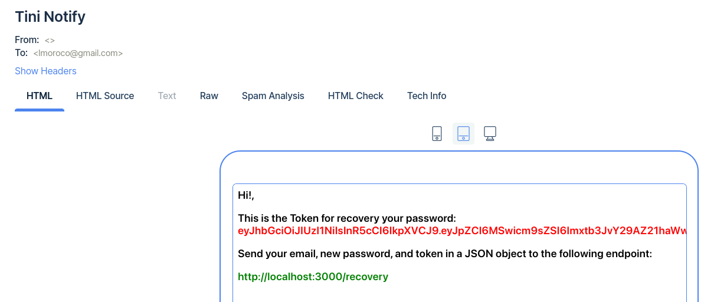
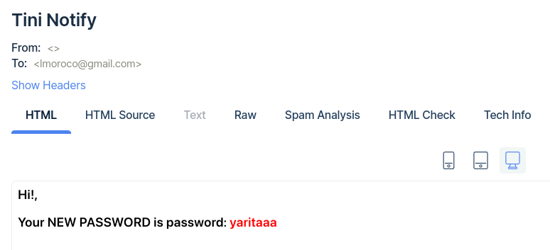

# luismoroco-Ravn-Challenge-V2-LuisAngelMoroco
This is an online store repository built with PostgreSQL and Prisma as the database layer, Express, Typescript and REST. This repository represents a challenge for a Node.js developer trainee position. 

# Structure 

```
proyecto/
├── node_modules/
├── prisma/
├── docs/
├── src/
│   ├── index.ts
│   ├──__test__/
│   │   ├── api/
│   │   ├── modules/
│   │   └── ...
│   ├── api/
│   │   ├── docs.ts
│   │   └── main.ts
│   ├── config/
│   │   ├── mailer.ts
│   │   ├── multer.ts
│   │   └── ...
│   ├── middleware/
│   │   ├── client.ts
│   │   └── manager.ts
│   ├── modules/
│   │   ├── auth/
│   │   │    ├── controller.ts
│   │   │    ├── services.ts
│   │   │    └── DAL.ts
│   │   └── ...
│   ├── patterns/
│   │    ├── server.Singleton.ts
│   │    └── ...
│   ├── services/
│   │   ├── forgot.password.ts
│   │   └── ...
│   └── utils/
│       ├── lib.ts
│       └── ...
├── tests/
│   ├── unit/
│   └── integration/
├── uploads/
├── .gitignore
├── package.json
└── README.md
```
# SCREENSHOTS

## Mail
Send an email when left <= 3 item only


## Changue Password 

Using MAILTRAP for send emails
Send an email when the user change the password





# Run Locally

Clone repository
```bash
  git clone https://github.com/luismoroco/Ravn-Challenge-V2-LuisAngelMoroco.git
```
init Postgress image
```bash
  docker-compose up -d
```
Install dependecies
```bash
  yarn install
```
Migrate  Prisma Model
```bash
  yarn prisma
```

# Swagger API 
http://localhost:3000/documentation